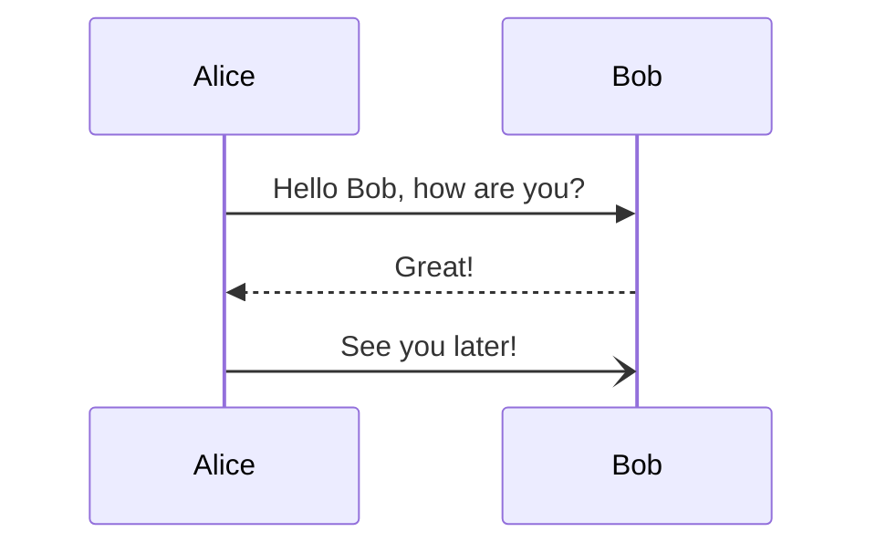

# Preparing the environment

In this tutorial we use [SDKman](https://sdkman.io). It should already be installed. Check with `sdk version`{{execute}} or reload the config with `[ -d ~/.sdkman ] && source ~/.bashrc`{{execute}}.

If not, it can be installed with `curl -s "https://get.sdkman.io" | bash`{{execute}}.



## Install Java and Maven

```
sdk install java
sdk install maven
```{{execute}}

Check the installation with

`mvn -version`{{execute}}


## Download the example code

```
mkdir -p ~/Develop; cd ~/Develop
git clone https://github.com/maddingo/oauth2-tutorial.git
cd oauth2-tutorial
```{{execute}}

